# Deep Learning Interactive Academy
## أكاديمية التعلم العميق التفاعلية — From Foundations to Deep Neural Networks

**Designed for Teaching and Research by Dr. Marwan Roudane — الدكتور مروان رودان**

[](#installation)
[](#installation)
[](#frameworks)
[](#frameworks)
[-EE4C2C?logo=pytorch&logoColor=white)](#frameworks)
[](#tests--validation)

An **Arabic-first, interactive learning platform for Deep Learning**, built with Python and Streamlit.
It takes a learner from "what is a dataset?" to building, training, diagnosing and presenting
CNN / RNN / LSTM / GRU projects in Keras, TensorFlow and PyTorch — with **every concept explained
before it is used**, and **every number on screen produced by code that really runs**.

It is neither a dashboard nor a static e-book. Each concept goes through the full loop:

> **Learn → See → Manipulate → Calculate → Code → Run → Break → Diagnose → Fix → Compare → Understand → Practice**

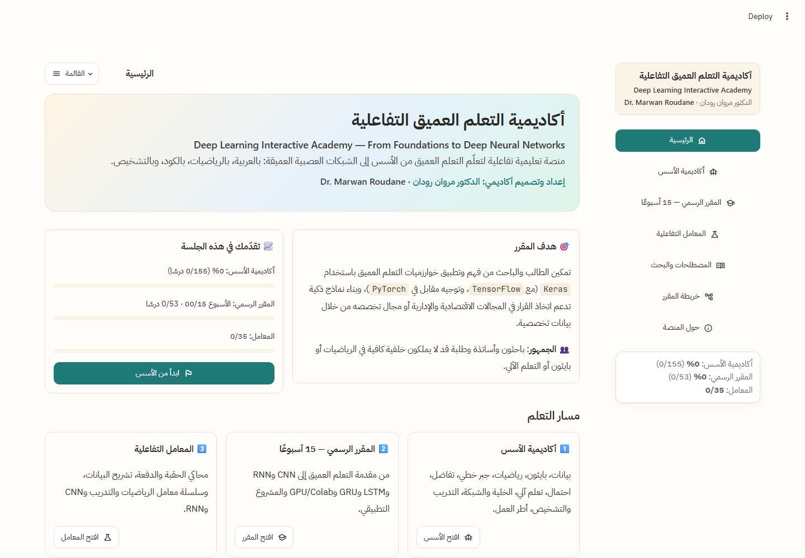

---

## Table of contents

- [Who it is for](#who-it-is-for)
- [What is inside](#what-is-inside)
  - [Foundations Academy — 24 modules](#1-foundations-academy--24-modules-155-lessons)
  - [Official Course — 15 weeks](#2-official-course--15-weeks-53-lessons)
  - [Interactive Labs — 35](#3-interactive-labs--35)
  - [Glossary, search, course map](#4-glossary-search-and-course-map)
- [Screenshots](#screenshots)
- [Pedagogical design](#pedagogical-design)
- [Frameworks](#frameworks)
- [Installation](#installation)
- [Running the app](#running-the-app)
- [Tests & validation](#tests--validation)
- [Project structure](#project-structure)
- [Adding content](#adding-content)
- [Documentation](#documentation)
- [Author](#author)

---

## Who it is for

- **Students and researchers** in economics, management, finance and the social sciences who want to
  *use* deep learning on their own data (tabular, time-series, images, text) but do not have a strong
  background in mathematics, Python or machine learning.
- **Instructors** teaching a one-semester deep-learning course who want a complete, runnable, Arabic
  curriculum with pre-tests, post-tests, labs, a project guide and a grading rubric.
- **Self-learners** who prefer to *see and manipulate* a concept (a sliding kernel, a gate opening,
  a gradient shrinking through time) rather than read about it.

The interface is fully **right-to-left Arabic** with English technical terms kept in Latin script,
so the learner reads Arabic explanations but recognises `epoch`, `batch_size`, `GradientTape`,
`zero_grad()` exactly as they appear in real code and documentation.

---

## What is inside

| Section | Content |
|---|---|
| **Home** | purpose, audience, "resume where you stopped", progress bars, quick access to labs |
| **Foundations Academy** | 24 modules / 155 lessons — everything a learner must know *before* deep learning, plus a full Keras / TensorFlow / PyTorch academy |
| **Official Course** | the mandatory 15-week syllabus / 53 lessons — every week has an overview + pre-test, lessons with running code labs, and a post-test |
| **Interactive Labs** | 35 real experiments: data, math, training, evaluation, frameworks, CNN, sequence models |
| **Glossary / Search** | 146 terms, one canonical Arabic term per English term, bilingual search, every term linked to the lesson that explains it |
| **Course Map / Knowledge Graph** | the seven official axes → weeks, a prerequisite explorer ("what must I know before this? where am I? what comes next?") |
| **About** | identity, objectives, design principles |

### 1. Foundations Academy — 24 modules (155 lessons)

| # | Module | Lessons | What the learner can do afterwards |
|---:|---|---:|---|
| 0 | Start Here | 7 | use the platform, read the RTL/LTR layout, understand the learning loop |
| 1 | Data Foundations | 10 | describe a dataset: observations, features, target, shape / axis / rank, dtypes, missing values |
| 2 | Python for Deep Learning | 10 | NumPy arrays, broadcasting, indexing, pandas, functions and classes needed to read framework code |
| 3 | Mathematical Foundations | 4 | notation, functions, sums and products, logs and exponentials |
| 4 | Linear Algebra | 5 | vectors, matrices, dot products, matrix multiplication as "a layer" |
| 5 | Calculus | 5 | slope, derivative, partial derivative, gradient, chain rule |
| 6 | Probability & Statistics | 5 | distributions, expectation, variance, likelihood, cross-entropy |
| 7 | Machine Learning Foundations | 6 | supervised learning, regression vs classification, baselines, generalisation |
| 8 | Data Preparation | 7 | train/validation/test split, scaling, encoding, class imbalance, **data leakage** |
| 9 | From Regression to the Neuron | 4 | linear → logistic regression → the artificial neuron |
| 10 | Network Architecture | 4 | layers, depth vs width, parameter counting |
| 11 | Activation Foundations | 6 | sigmoid, tanh, ReLU and its family, softmax, dead ReLU |
| 12 | Forward Pass | 4 | tracing shapes and values through a network by hand |
| 13 | Error, Loss & Objective | 5 | MSE, MAE, binary / categorical cross-entropy, what a loss curve means |
| 14 | Backpropagation | 8 | the chain rule on a network, step by step, checked against finite differences |
| 15 | Optimization | 7 | gradient descent, learning rate, SGD, momentum, RMSProp, Adam, schedules |
| 16 | The Training Loop | 3 | the twelve steps that every framework hides |
| 17 | Batch, Epoch & Iteration | 2 | the arithmetic of `steps_per_epoch`, with a simulator |
| 18 | Model Evaluation | 5 | accuracy, precision, recall, F1, confusion matrix, thresholds, ROC-AUC |
| 19 | Generalization | 4 | underfitting, overfitting, reading training curves |
| 20 | Regularization | 5 | L2, dropout, early stopping, batch normalization, data augmentation |
| 21 | **Frameworks Academy** | 30 | Keras (`Sequential`, `compile`, `fit`, `evaluate`, callbacks, saving, `summary()` deconstruction, error catalogue), TensorFlow (tensors, `GradientTape`, `tf.data`, custom loops, TensorBoard), PyTorch (tensors, autograd, `nn.Module`, losses / optimizers / `DataLoader`, the training loop line by line, `zero_grad`, `train()` / `eval()`, `state_dict`), a 37-row concept map Keras ↔ TensorFlow ↔ PyTorch, the same model in three views, and a framework-choice guide |
| 22 | Framework Visual Gallery | 5 | reading real notebook outputs: `fit` logs, `summary()` tables, PyTorch loop prints, TensorBoard, and a catalogue of real error messages — each with six reading questions |
| 23 | Ready for Deep Learning | 4 | concept map, a 21-item self-check + 20-question diagnostic, six challenges, and a readiness status computed from the learner's scores |

### 2. Official Course — 15 weeks (53 lessons)

Every week has an **overview page with a pre-test**, lessons whose code labs actually train models,
and a **post-test**. The seven official axes map onto the weeks as follows:

| Axis | Week | Title | Highlights |
|---|---:|---|---|
| ML basics | 01 | Introduction to Deep Learning | what DL is and is not, prediction vs causality, the course contract |
| ML basics | 02 | Machine Learning Foundations | model types, evaluation and baselines, from ML to DL |
| FFNN | 03 | Keras & TensorFlow with a comparative PyTorch orientation | first network, under the hood, the PyTorch equivalent |
| FFNN | 04 | Feedforward Neural Networks | forward flow, depth vs width experiments |
| Optimization | 05 | Optimization Algorithms | GD / learning rate / SGD, momentum / RMSProp / Adam, loss surfaces and convergence |
| Optimization | 06 | Activation Functions | functions and derivatives, choosing activations experimentally |
| FFNN | 07 | General Applied Project | a complete pipeline on tabular data, diagnosis and interpretation |
| CNN | 08 | CNN core concepts | convolution (animated kernel), padding / stride / pooling, layers and shapes |
| CNN | 09 | CNN applications | build and train, overfitting and augmentation, feature maps and shape debugging |
| RNN | 10 | Recurrent Neural Networks | sequences and hidden state, BPTT and vanishing gradients, a time-series application |
| LSTM | 11 | LSTM | windows and padding, the cell and its gate equations, train / evaluate / diagnose |
| GRU | 12 | GRU | update and reset gates, the three-way RNN vs LSTM vs GRU comparison, applications |
| GRU | 13 | GPU & Google Colab | CPU vs GPU vs memory, batch size and OOM, the Colab runtime |
| GRU | 14 | Applied Project | a 17-stage project guide with a session checklist, and a notebook template |
| GRU | 15 | Project Presentation & Discussion | presenting evidence, the discussion questions, a 12-criterion rubric with self-assessment, and the course post-test |

### 3. Interactive Labs — 35

| Category | Labs |
|---|---|
| Data | Dataset Anatomy · Scaling · Data Split · Data Leakage |
| Math | Tensor Shape Explorer · Vector / Matrix · Slope & Derivative · Gradient · Chain Rule |
| Training | Epoch / Batch Simulator · Neuron · Interactive Network Builder · Parameter Counter · Activation Function · Loss Function · Gradient Descent · Learning Rate · Optimizer Race · Training Loop Simulator · Regularization (L2) · Dropout |
| Evaluation | Confusion Matrix · Threshold · Overfitting · Training Curves Diagnostic |
| Frameworks | TensorFlow Tensor Explorer · GradientTape · PyTorch Tensor Explorer · GPU / Batch Memory |
| CNN | Convolution (animated kernel) · Padding / Stride / Pooling · CNN Shape Calculator |
| Sequence | RNN Unrolling · LSTM Gates · GRU Gates |

Every lab is a real computation (NumPy, scikit-learn, Keras or PyTorch), not a canned animation:
change a slider and the numbers, tables and curves are recomputed.

### 4. Glossary, search and course map

- **146 glossary terms**, each with one canonical Arabic term, the English term, a short definition and a
  link to the lesson that introduces it. The registry test guarantees that no two terms share an Arabic label.
- **Bilingual search** over lessons, labs and terms.
- **Course map / knowledge graph**: the official axes, the week list, and a prerequisite explorer that shows
  for any lesson what must be known first, where the learner is, and what comes next.
- **Progress** is tracked per session (lessons opened, labs completed, quiz and diagnostic scores) and shown on
  the home page and in the sidebar.

---

## Screenshots

### Foundations Academy and the course

| Foundations landing | Course landing |
|---|---|
| 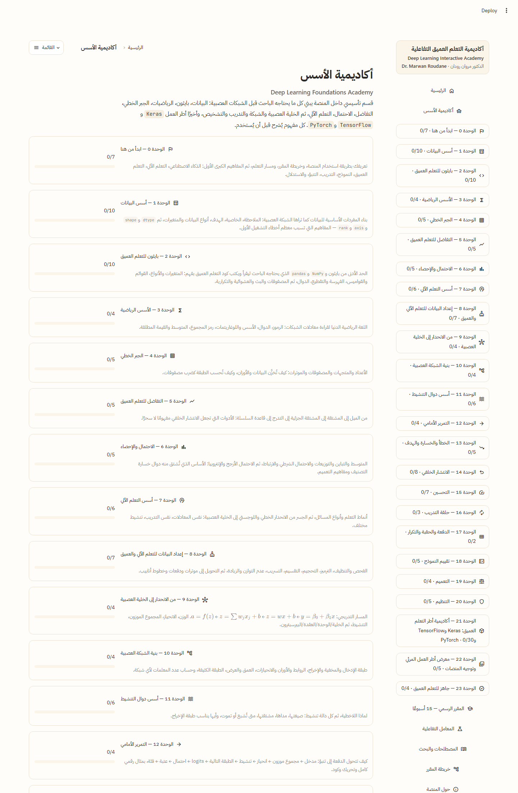 | 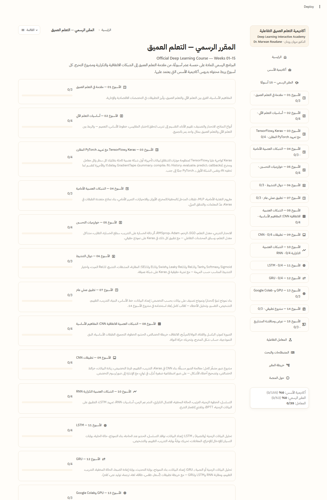 |

### A Keras lesson: `fit()` — the hidden loop, with a live visualizer

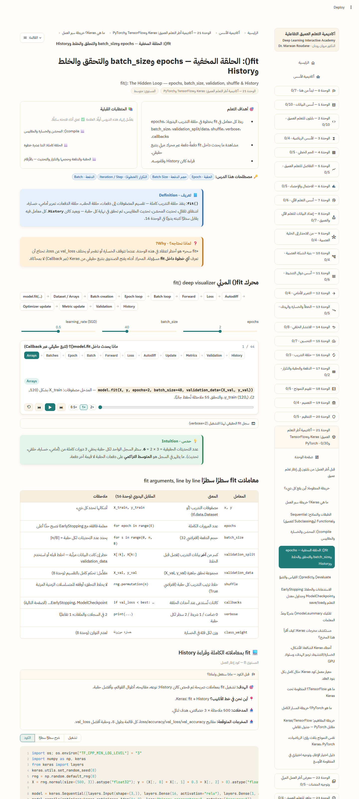

### PyTorch training loop — line-by-line visualizer

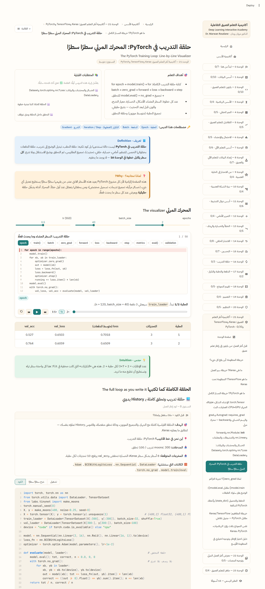

### Week 05 — momentum, RMSProp and Adam on a real loss surface

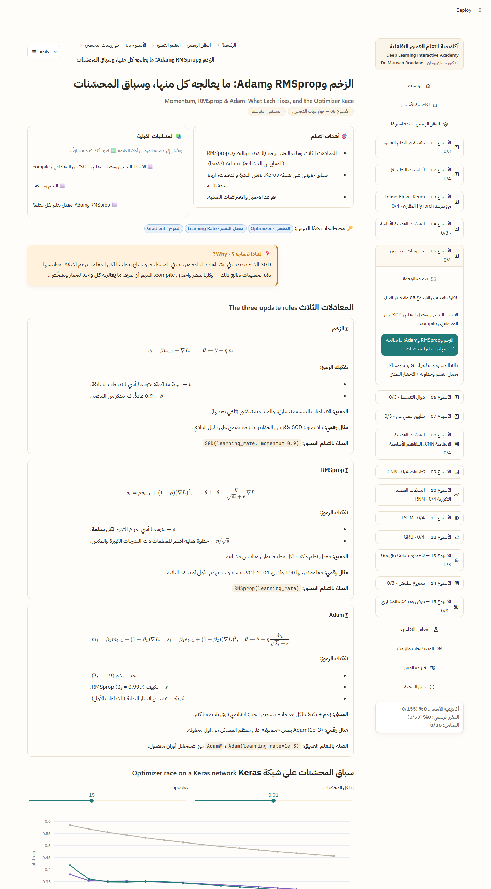

### Week 08 — convolution, and the animated-kernel lab

| Week 08 lesson | CNN convolution lab |
|---|---|
| 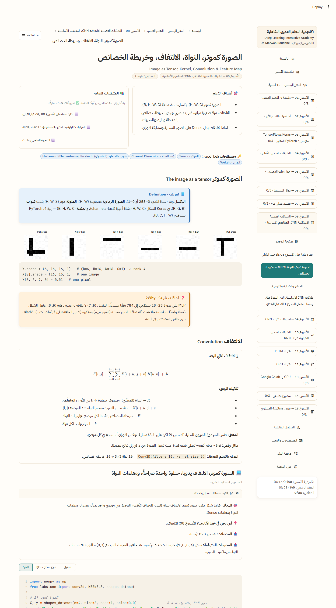 | 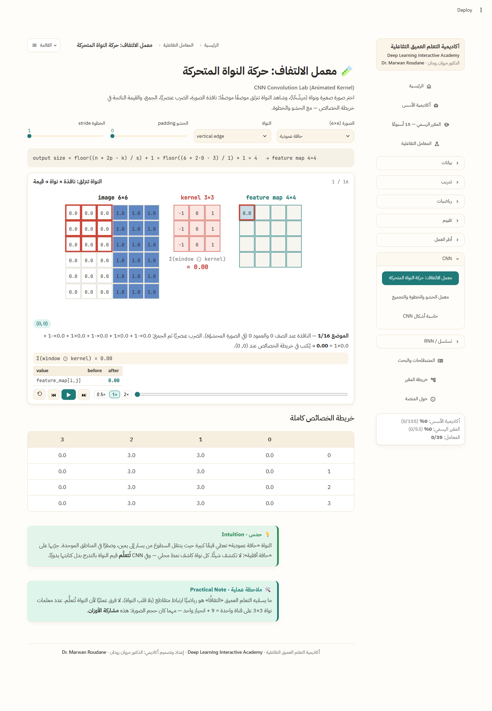 |

### Week 12 — RNN vs LSTM vs GRU, trained live on the same pipeline

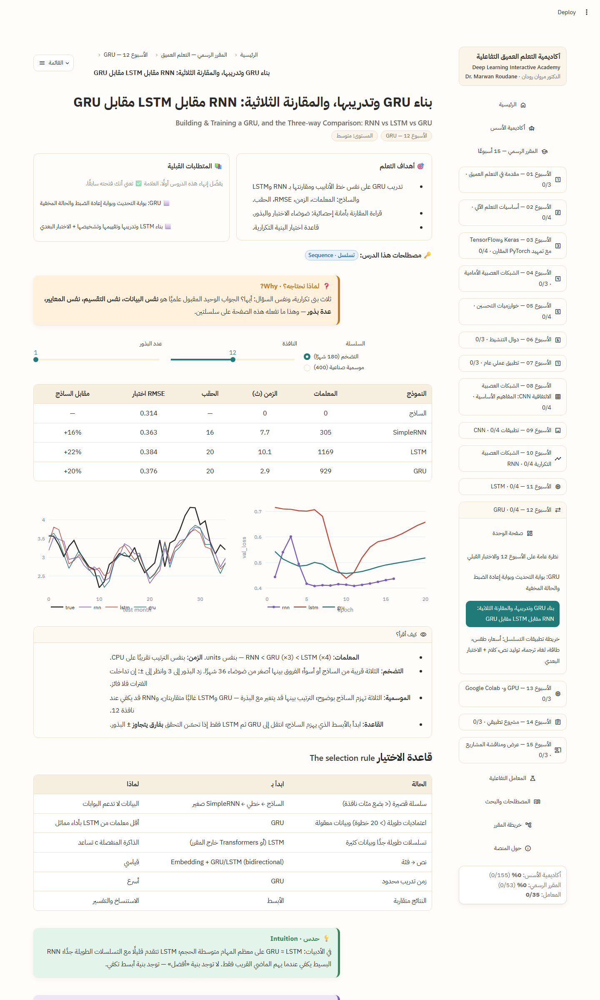

### LSTM gates lab

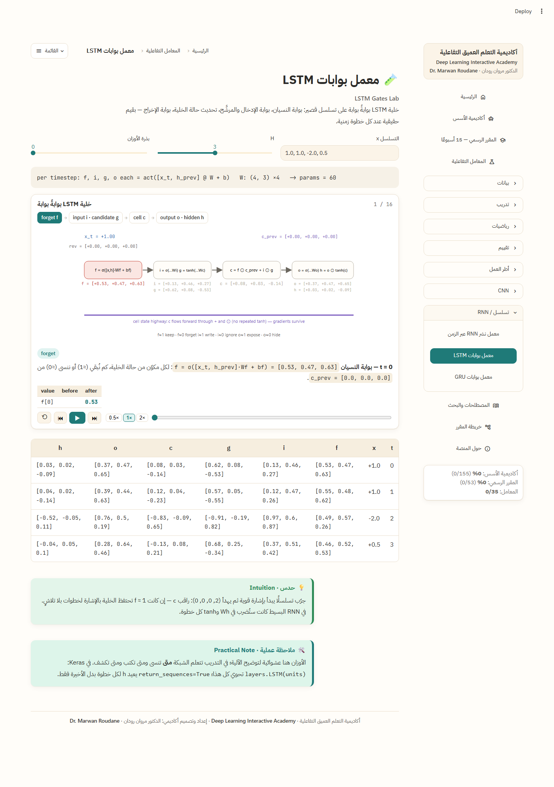

### Framework gallery — reading real error messages

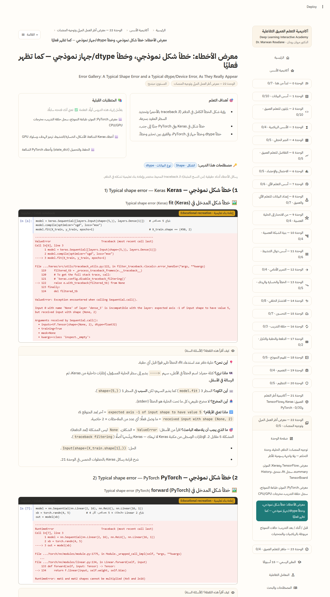

### Readiness status, final rubric, course map, glossary

| Readiness status (module 23) | Final rubric with self-assessment (week 15) |
|---|---|
| 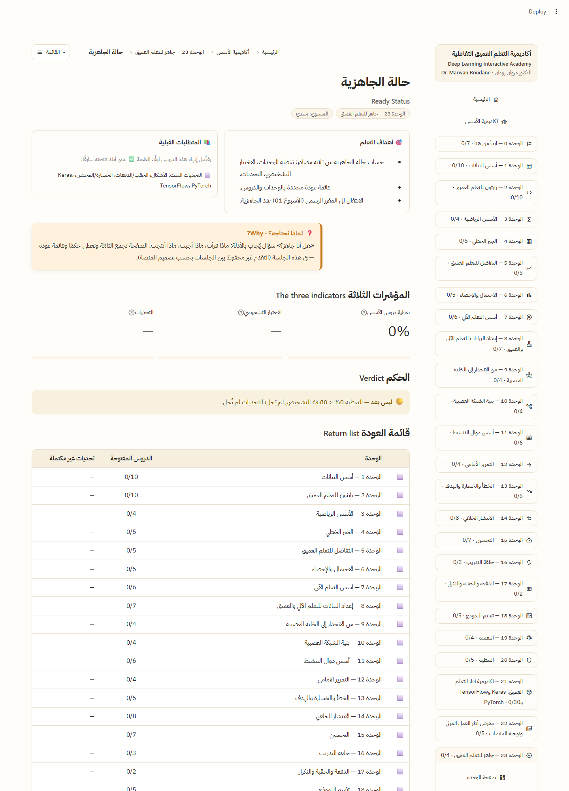 | 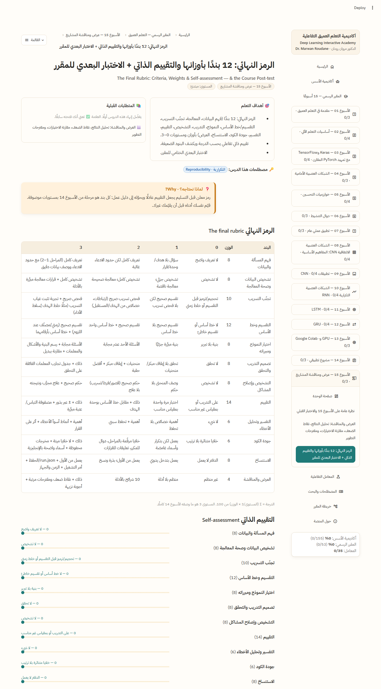 |

| Course map & knowledge graph | Glossary & search |
|---|---|
| 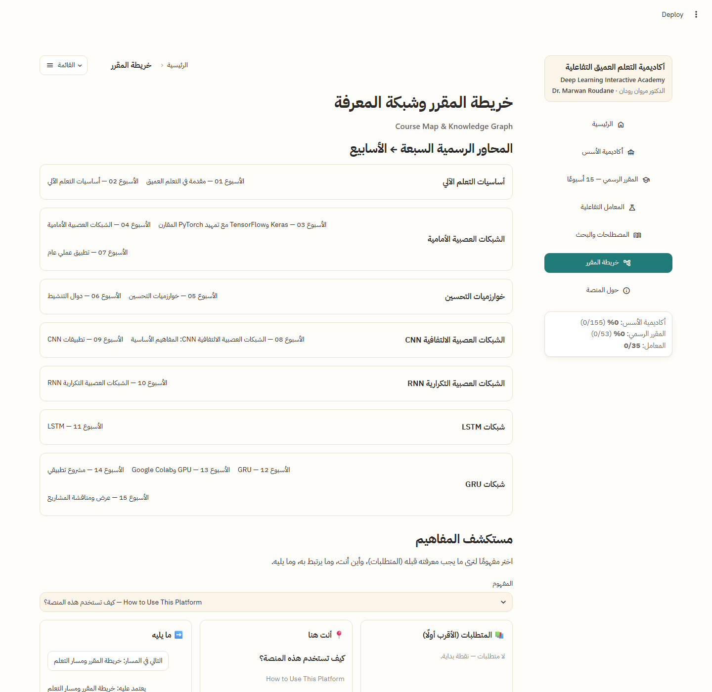 | 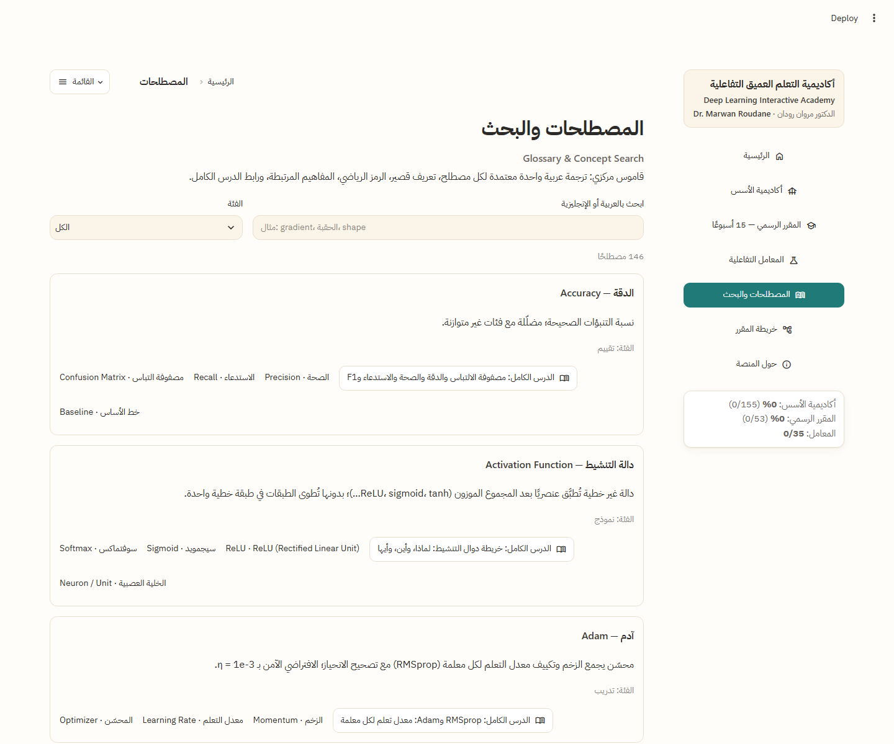 |

| Interactive labs |
|---|
| 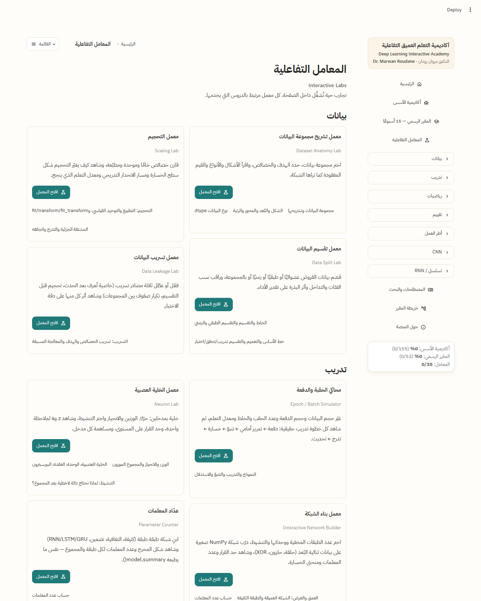 |

---

## Pedagogical design

The platform follows a set of explicit rules, all enforced by the content standards and the test-suite:

1. **No term before its explanation.** Every lesson declares the glossary terms it uses; a term is either
   explained in that lesson or linked to the lesson that explains it.
2. **The Code Understanding Contract.** A learner never sees a line of Keras / PyTorch without knowing what
   it does *mathematically*: `model.fit()` is taught only after the learner has written the training loop by hand
   (module 16) and can count the steps per epoch (module 17).
3. **Every number is real.** Code labs execute the code shown; framework outputs in the gallery are
   *educational recreations* of real outputs and labelled as such.
4. **Honest results.** When a deep model loses to a naive baseline (as RNN / LSTM / GRU do on the 180-month
   inflation series), the lesson says so and teaches the learner to read the noise across seeds.
5. **Diagnostics first.** An 18-point problem framework (symptom → cause → evidence → fix) runs through
   the foundations, the course and the project guide.
6. **Functional animation only.** Every animation (sliding kernel, unrolled RNN, autograd graph, the
   highlighted line in the PyTorch loop) shows a computation the learner can pause, step and read; no decoration.
7. **Bidirectional typography.** Arabic prose is right-to-left; code, equations, tables of numbers and English
   terms stay left-to-right inside it.
8. **Assessment at every level.** Quizzes inside lessons, a pre-test and a post-test per week, a 20-question
   diagnostic and six challenges in module 23, a 12-criterion rubric for the final project.

---

## Frameworks

| Library | Version | Used for |
|---|---|---|
| TensorFlow | 2.20.0 | tensors, `GradientTape`, `tf.data`, custom loops, TensorBoard lesson |
| Keras | 3.15.1 (TensorFlow backend) | all high-level models: MLPs, small CNNs, SimpleRNN / LSTM / GRU |
| PyTorch | 2.14.0 (CPU build) | tensors, autograd, `nn.Module`, the explicit training loop, `state_dict` |
| NumPy / pandas / scikit-learn | 2.4 / 3.0 / 1.9 | all "by hand" computations, baselines, metrics, datasets |
| Plotly | 7.0 | interactive curves and surfaces |

All frameworks are **imported lazily** inside the lessons and labs that need them (`labs/fw.py`), so the
foundations modules 0–20 open instantly even on a machine without TensorFlow or PyTorch installed.
Every model in the platform trains **on CPU in seconds by design**; the same code runs unchanged on a
Colab GPU (week 13).

---

## Installation

Requirements: **Python 3.11 or newer**.

```bash
git clone https://github.com/merwanroudane/DLlab.git
cd DLlab
python -m venv .venv
```

Windows:

```bash
.venv\Scripts\python -m pip install --upgrade pip
.venv\Scripts\python -m pip install -r requirements.txt
```

Linux / macOS:

```bash
.venv/bin/python -m pip install --upgrade pip
.venv/bin/python -m pip install -r requirements.txt
```

`requirements.txt` points Linux installs at the CPU-only PyTorch index
(`--extra-index-url https://download.pytorch.org/whl/cpu`), so no CUDA wheels are downloaded.
If pip still cannot find the CPU build on your platform:

```bash
pip install torch==2.14.0 --index-url https://download.pytorch.org/whl/cpu
```

### Deploying on Streamlit Community Cloud

1. **Create app → Deploy a public app from GitHub**: repository `merwanroudane/DLlab`, branch `main`,
   main file `streamlit_app.py`.
2. In **Advanced settings** choose **Python 3.11** (3.12 / 3.13 also work). This must be done in the
   deploy dialog: Community Cloud ignores `.python-version` and the Python version of an existing app
   cannot be changed — delete the app and deploy again if it was created with the default (3.14).
   TensorFlow has no wheels for Python 3.14, so on 3.14 the install fails with
   `No matching distribution found for tensorflow==2.20.0`.
3. Deploy — the first build downloads TensorFlow (~620 MB) and CPU PyTorch (~200 MB) and takes a few
   minutes; later reboots reuse the cached environment.

---

## Running the app

```bash
.venv\Scripts\python -m streamlit run streamlit_app.py
```

Then open `http://localhost:8501`.
Every page has a stable URL through the `p` query parameter, for example:

| URL | Page |
|---|---|
| `?p=home` | home |
| `?p=foundations` | Foundations Academy landing |
| `?p=foundations.backprop` | module 14 landing |
| `?p=foundations.frameworks.keras.fit` | the Keras `fit()` lesson |
| `?p=course.w12.compare_rnn_lstm_gru` | week 12, RNN vs LSTM vs GRU |
| `?p=labs.cnn_convolution_lab` | the convolution lab |
| `?p=glossary`, `?p=map`, `?p=about` | glossary, course map, about |

On Windows the console is cp1252; run the tools with `PYTHONIOENCODING=utf-8` if you see encoding errors.

---

## Tests & validation

```bash
.venv\Scripts\python -m pytest tests -q
.venv\Scripts\python validate_content.py
```

The test-suite (339 tests) covers:

- **Math helpers** — steps per epoch, SGD simulation and divergence, hand-written gradients against
  finite differences, packaged datasets, bidirectional table / markup helpers.
- **Framework helpers** — pinned versions, Keras runs returning plain data, one `fit` batch event per
  update, `summary()` parameter accounting with BatchNorm, PyTorch loop traces and weight updates, the
  `zero_grad` accumulation experiment, gallery outputs produced by the real libraries, module-23 scoring.
- **The content registry** — id conventions, reading order, previous / next chains, sub-pages,
  prerequisites pointing backwards, prerequisite graph acyclicity, glossary uniqueness and linking,
  complete lesson metadata, bilingual search, breadcrumbs, static routes.
- **The app** — a headless render of **every route** with the real app (`st.testing.v1.AppTest`),
  navigation, progress, quiz scoring, the epoch simulator, and the **execution of every code lab** with
  the real frameworks — this is why the full suite takes about fourteen minutes on a laptop CPU.
  `tests/test_registry.py` and `tests/test_frameworks.py` alone take about fifteen seconds and are the
  quick smoke check.

`validate_content.py` prints the registry summary (`sections=3 modules=39 lessons=208 labs=35 terms=146`)
and lists any broken link, missing term or ordering problem.

---

## Project structure

```
streamlit_app.py          entry point: router, layout, sidebar
core/                     models (Lesson, Module, Lab, Term), registry, routing, RTL/LTR helpers, progress
components/               reusable teaching widgets: callouts, math explainer, comparison tables, diagrams,
                          quizzes, code labs, diagnostics cards, animation player, output gallery, week pages
content/
  foundations/            m00_start … m23_ready — one package per module, one file per lesson
  course/                 w01_intro … w15_presentation — one package per week
  glossary/terms.py       the 146 glossary terms
labs/                     35 interactive labs + cnn.py / rnn.py (hand-written math) + fw.py (framework helpers)
app_pages/                home, section landings, glossary, map, about
assets/                   CSS and static assets
tests/                    pytest suite
docs/                     architecture, curriculum map, content standards, RTL guide, screenshots
validate_content.py       registry validator CLI
CONTINUATION.md           build state and how to resume work
```

A lesson is a Python module exposing a `LESSON = Lesson(...)` object (id, Arabic and English titles,
prerequisites, objectives, glossary terms, difficulty, summary) and a `render()` function. Modules register
their lessons in `LESSON_MODULES`; sections register modules in `MODULE_PACKAGES`. The registry is built
once from these declarations and drives navigation, breadcrumbs, prerequisites, progress and the tests.

---

## Adding content

1. Create `content/<section>/<module>/<lesson>.py` with a `LESSON` and a `render()`.
2. Add the file name to the module's `LESSON_MODULES`.
3. Declare the glossary terms you use in `terms=[...]`; add missing ones to `content/glossary/terms.py`.
4. Run `validate_content.py` and `pytest tests/test_registry.py`.

See [docs/CONTRIBUTING_CONTENT.md](docs/CONTRIBUTING_CONTENT.md) for the lesson template and
[docs/CONTENT_STANDARDS.md](docs/CONTENT_STANDARDS.md) for the quality gates a lesson must pass.

---

## Documentation

- [docs/ARCHITECTURE.md](docs/ARCHITECTURE.md) — modules, routing, registry, layout
- [docs/CURRICULUM_MAP.md](docs/CURRICULUM_MAP.md) — modules ↔ weeks ↔ official axes, build status
- [docs/CONTENT_STANDARDS.md](docs/CONTENT_STANDARDS.md) — what a lesson must contain, quality gates
- [docs/RTL_LTR_GUIDE.md](docs/RTL_LTR_GUIDE.md) — bidirectional typography rules
- [docs/ANIMATION_STANDARDS.md](docs/ANIMATION_STANDARDS.md) — the functional-animation contract
- [docs/DIAGNOSTICS_STANDARDS.md](docs/DIAGNOSTICS_STANDARDS.md) — the 18-point problem framework
- [docs/CONTRIBUTING_CONTENT.md](docs/CONTRIBUTING_CONTENT.md) — how to add a lesson / lab / term
- [CONTINUATION.md](CONTINUATION.md) — build status and exact next tasks

---

## Author

**Dr. Marwan Roudane — الدكتور مروان رودان**
GitHub: [merwanroudane](https://github.com/merwanroudane)
